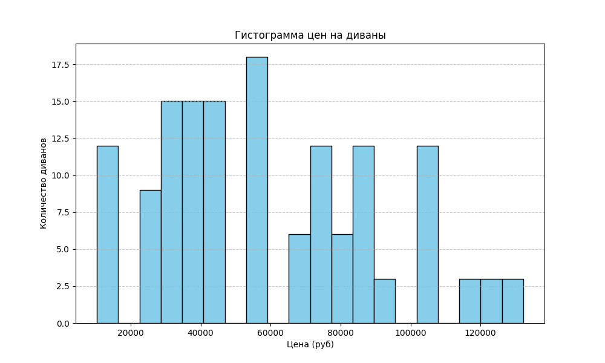

# AZ03_price-histogram

# Проект по парсингу и анализу цен на диваны с сайта divan.ru

## Цель проекта

Целью проекта является автоматизированный сбор данных о ценах на диваны с сайта [divan.ru](https://www.divan.ru/), последующая обработка данных, а также их анализ. Итоговые данные используются для построения гистограммы цен, что позволяет получить представление о ценовом распределении.

## Структура и описание файлов

### Основные этапы

1. **Сбор данных с сайта с использованием Scrapy.**
   - Класс `DivannewparsSpider` отвечает за парсинг и извлечение названий диванов и их цен.
   - Данные сохраняются в файл `raw_prices.csv`.

2. **Обработка данных.**
   - Функция `process_data` обрабатывает данные из `raw_prices.csv`, убирает лишние символы (например, `₽/мес.`) и конвертирует цены в числовой формат.
   - Обработанные данные сохраняются в `cleaned_prices.csv`.

3. **Анализ и визуализация данных.**
   - Функция `plot_histogram` рассчитывает среднюю цену дивана и строит гистограмму распределения цен.
   - Результаты анализа выводятся в консоль и визуализируются с помощью гистограммы.

### Файлы проекта

- `raw_prices.csv` — файл, содержащий исходные данные с сайта.
- `cleaned_prices.csv` — файл, содержащий обработанные данные, пригодные для анализа.
- `README.md` — файл с описанием проекта и инструкциями по запуску.

### Основные компоненты кода

import scrapy
import csv
import matplotlib.pyplot as plt
from scrapy.crawler import CrawlerProcess

class DivannewparsSpider(scrapy.Spider):
    name = "divannewpars"
    allowed_domains = ["divan.ru"]
    start_urls = ["https://www.divan.ru/category/divany-i-kresla"]

    custom_settings = {
        'FEED_FORMAT': 'csv',  # Формат файла для сырого вывода
        'FEED_URI': 'raw_prices.csv'  # Название файла для сырого вывода
    }

    def parse(self, response):
        divans = response.css('div._Ud0k')
        for divan in divans:
            yield {
                'name': divan.css('div.lsooF span::text').get(),
                'price': divan.css('div.pY3d2 span::text').get()
            }

def process_data(input_file, output_file):
    cleaned_data = []
    with open(input_file, 'r', encoding='utf-8') as infile, open(output_file, 'w', newline='', encoding='utf-8') as outfile:
        reader = csv.DictReader(infile)
        fieldnames = ['name', 'price']
        writer = csv.DictWriter(outfile, fieldnames=fieldnames)
        writer.writeheader()

        for row in reader:
            price_text = row['price'].replace(' ₽/мес.', '').replace(' ', '')
            try:
                price = int(price_text)  # Преобразуем цену в целое число
                row['price'] = price
                cleaned_data.append(price)
                writer.writerow(row)
            except ValueError:
                continue  # Пропускаем строки, где не удалось преобразовать цену

    return cleaned_data

def plot_histogram(data):
    average_price = sum(data) / len(data) if data else 0
    print(f"Средняя цена на диваны: {average_price:.2f} руб.")

    # Построение гистограммы
    plt.figure(figsize=(10, 6))
    plt.hist(data, bins=20, color='skyblue', edgecolor='black')
    plt.title('Гистограмма цен на диваны')
    plt.xlabel('Цена (руб)')
    plt.ylabel('Количество диванов')
    plt.grid(axis='y', linestyle='--', alpha=0.7)
    plt.show()

# Запуск процесса парсинга
process = CrawlerProcess()
process.crawl(DivannewparsSpider)
process.start()

# Обработка данных и построение гистограммы
input_file = 'raw_prices.csv'
output_file = 'cleaned_prices.csv'
cleaned_data = process_data(input_file, output_file)
plot_histogram(cleaned_data)

## Как запустить проект

1. Убедитесь, что установлены необходимые библиотеки:

   pip install scrapy matplotlib
Запустите скрипт в командной строке:

bash
Копировать код
python <имя_файла>.py
После выполнения скрипта:

В консоли отобразится средняя цена диванов.
Откроется окно с гистограммой цен.

